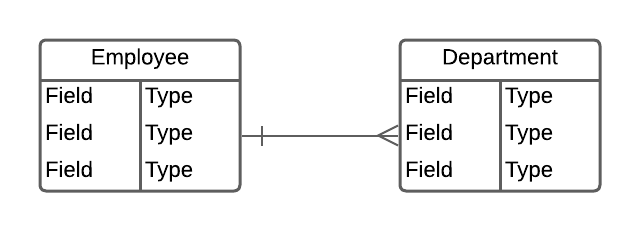
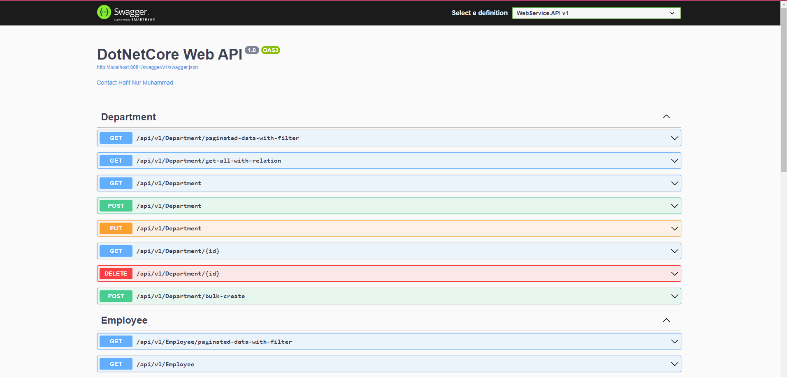

# DotNetCore Web API - Technical Test


## Tentang Project

Ini merupakan project menggunakan Framework ASP .NET Core (6.0) untuk membuat Web Service (Restful API). Dengan skenario penginputan data Employee beserta Department nya.

## Entity Relation Diagram (ERD)

Relasi dari kedua entitas adalah (One To Many) - (Many To One). Sebuah Employee hanya dapat memiliki satu Department dan Setiap Department dapat terdiri dari banyak Employee.

   

## Features

- Validation Request
- Costume Response Formatter
- Migration File using Entity Framework
- Structure Folder (Service & Repository Pattern)
- Docker File
- Unit Testing
- Logger using (SEQ)
- Auto Mapper
- Api Doc (Swagger)

## Installation

1. Menjalankan menggunakan Docker yang telah di push / deploy pada DOCKER HUB

```bash
1. Untuk repo image bisa di cek disini https://hub.docker.com/r/hafif123/dotnetcore-webapi
2. Bisa langsung menjalankan script pada docker-compose.yml -> `docker compose up`
3. Akses Apps pada URL : http://localhost:8081/swagger/index.html
4. Lakukan migrasi manual, connect pada database postgres dengan credential sebagai berikut
    - UserName : postgres
    - Password : rootuser
    - Host : localhost
    - Port : 5435
5. Setelah itu execute Script SQL yang ada pada Folder `cd WebService.Infrastructure/Migration/Script`
```

2. Menjalankan menggunakan Docker Manual
 
```bash
1. jalan kan script di luar folder WebService.API, `docker build -t dotnetcore-webapi -f .\WebService.API\Dockerfile .`
2. masuk pada folder -> `cd WebService.API/ -> docker compose up`
3. untuk tear down / cleaning -> `docker compose down`
```

3. Menjalankan Manual di Local Machine

```bash
1. masuk ke dalam folder `cd WebService.API/`, lalu jalan kan `dotnet-ef database update`
2. jika ingin tambah migrasi gunakan perintah ini -> `dotnet ef migrations add InitTable -p ..\WebService.Infrastructure`, di dalam folder WebService.API
```

## Import Postman Collection

1. Menjalankan Unit Testing

```bash
1. Di dalam WebService.API terdapat file .json hasil dari export postman `DotNetCore-WebAPI.postman_collection.json`, silahkan di import untuk melakukan API test menggunakan Postman
```

## Unit Testing

1. Menjalankan Unit Testing

```bash
1. Masuk ke dalam direktori WebService.Test
2. Unit Test telah di config agar dapat berjalan secara parralel, untuk menjalankan tuliskan perintah berikut `dotnet test`
```


## Hasil Test Swagger dan Postman serta Docker Image Running

1. Tampilan Swagger UI (API Doc)

   

2. Tampilan Docker Desktop (DotNetCore WebAPI - Postgres)

   

3. Tampilan Postman UI (API Test)

   

4. Tampilah Hasil Unit Test

   
